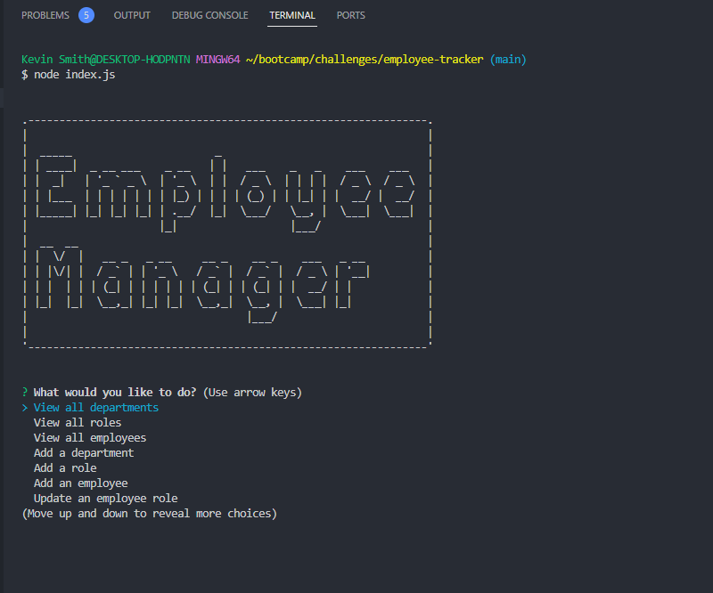

# Employee Tracker

## Description 

A command-line application utilizing Node.js, Inquirer, and MySQL for managing a company's employee database.

## Usage

To use this application, the user will need to clone the code to their local machine, run a "npm install" to install the required packages, and using MySQL, SOURCE the db/schema.sql and db/seeds.sql files, making any changes to the db/seeds.sql file seed data that are needed. I have provided some initial example seed data as a start. Once this is complete, running the command "node index.js" will start the application. The user will be presented with several choices to interact with the database. Using the arrow keys, the user can cycle between the various choices and hit enter to make a selection. When the user is ready to exit the application, they can scroll to the "Exit" choice and hit enter to quit and be brought back to the CLI.

Link to demonstration video:
[Employee Tracker Demo Video](https://salty-sands-14541-496b51c248e5.herokuapp.com/)

Screenshot of the application:

## Credits

Special thanks to Dominique Meeks Gombe, who provided tutoring and guidance to me while I was working on this project, as well as Leif Hetland and Fred Kamm, our class instructors, for additional support, assistance and oft needed morale boosting. I also referenced code guidance from the class repository to assist with this project.

In completing this project, I utilized the below resources to assist:

https://dev.mysql.com/  
https://www.w3schools.com/MySQL/default.asp
https://www.npmjs.com/package/mysql2#documentation 
https://www.npmjs.com/package/inquirer#documentation   
https://www.cloudways.com/blog/how-to-join-two-tables-mysql/  
https://www.asciiart.eu/text-to-ascii-art  
https://developer.mozilla.org/en-US/docs/Web/JavaScript/Reference/Classes  
https://developer.mozilla.org/en-US/docs/Web/JavaScript/Reference/Global_Objects/Promise  

## License

This project is covered under the MIT License.

## Badges

## Questions

Please visit my [GitHub profile](https://github.com/kevinsmithseven/) or email me at [kevinsmithseven@gmail.com](mailto:kevinsmithseven@gmail.com) with any questions.

